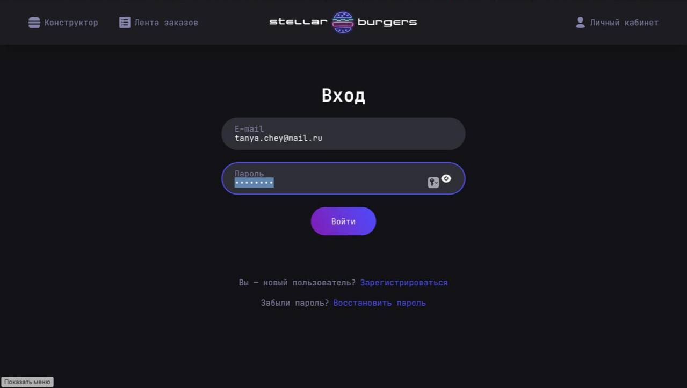
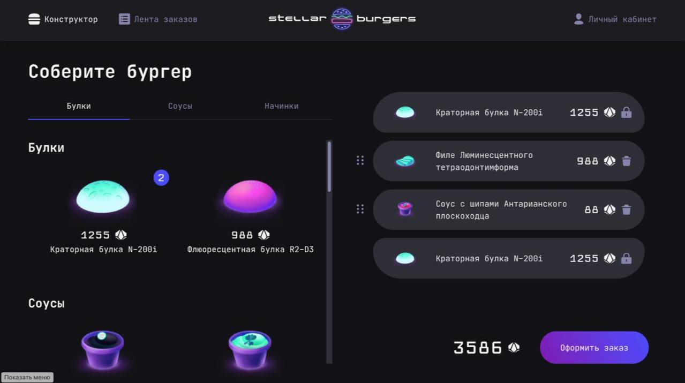
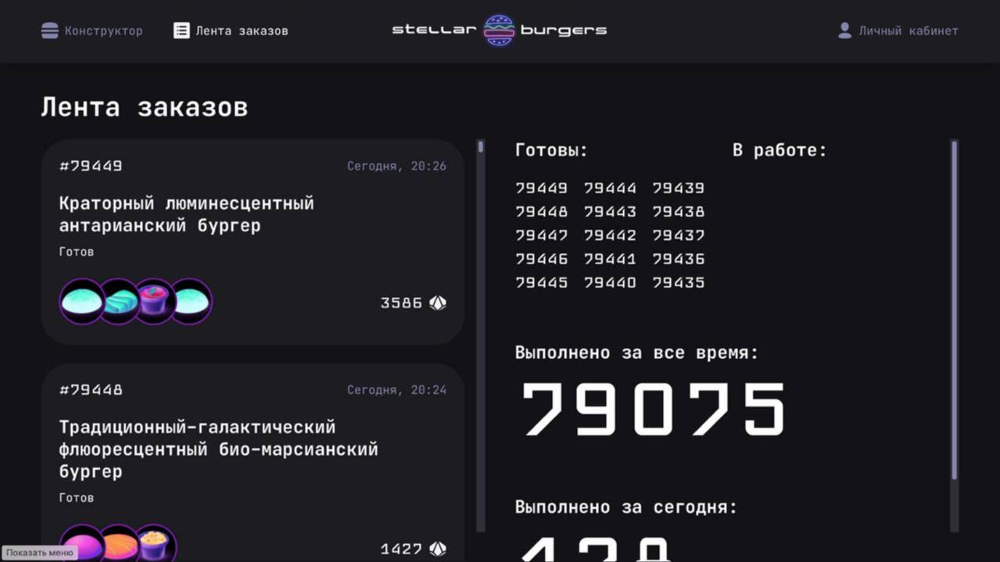
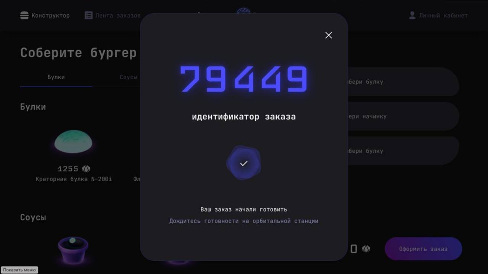
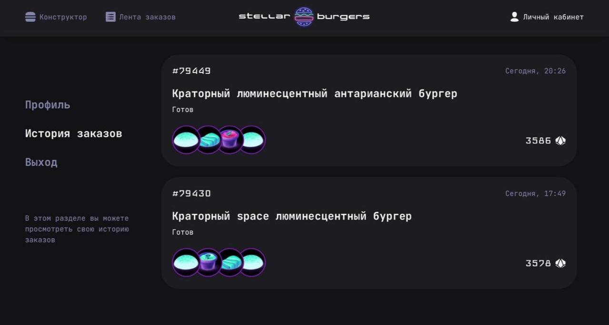

# Stellar Burger

[Проект Stellar Burger](https://github.com/TanyaChey/stellar-burger)

## Макет

[Макет](https://www.figma.com/design/vIywAvqfkOIRWGOkfOnReY/React-Fullstack_-Проектные-задачи--3-месяца-_external_link?node-id=849-1002&p=f&t=LudogNs3HbutrqYB-0)

## Запуск
```
npm install
npm start
```
## Запуск тестов
```
npm run cypress
```
```
npm test
```
## Описание

Stellar Burger - веб-приложение по заказу космических бургеров.

Стек: React, SCSS, TS, Webpack, Redux Toolkit

В ходе проектной работы:
- подключен роутер и реализовали маршруты;
- добавили глобальное состояние и подключили к страницам;
- реализовали механизм авторизацию и защититу личного кабинета пользователя;

## Скриншоты







## Исполнитель

- Github - [Chey Tatiana](https://github.com/TanyaChey)
- Telegram - [Chey Tatiana](https://t.me/TanyaChey)